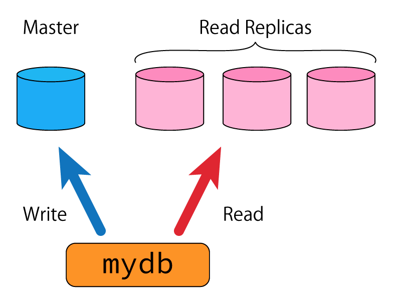

# Background

You are part of a team developing a web service that uses a managed MySQL DB from a public cloud provider with 1 master DB and multiple read replicas to spread the load.

The team is working on a library that can be used in the same way as the `DB` type from the `database/sql` package.

The purpose of this library is to automatically route read-only queries to read replicas, and all other queries to the master DB (see diagram), without the user having to be aware of it.



The master DB and read replicas need to be restarted periodically for maintenance. Unfortunately, the maintenance window can only be scheduled for the master DB. Maintenance of read replicas cannot be scheduled; however, it will always be performed one read replica at a time without overlaps.

It has come to light that the package, `mydb.go`, contains some issues which need urgent attention.

# Your Tasks

## Task 1

Consider the following points for the current state of the library.

* Does the library fulfill the requirements described in the background section?
* Is the library easy to use?
* Is the code quality assured?
* Is the code readable?
* Is the library thread-safe?

Write down any issues you see.

## Task 2

Resolve the issues discovered in the previous task by fixing the code.

You may, within reason:

* Use external libraries
* Add files or directories
* Rename functions, change parameters, and make other destructive changes

Ensure that it works on Go 1.12 and above

## Task 3

Explain what you did in the previous task and your reasoning behind it.

## When Submitting Your Answers

Please commit your code on the `master` branch in the specified GitHub repository.

Additionally, the following two files must be included:

* `answer.md`: your answers for Tasks 1 and 3
* `packages.txt`: the import paths of any packages you created, separated by newlines
  * This file will be processed by a machine
  * Example `packages.txt`:

    ```
    github.com/xxxxx/mydb
    github.com/xxxxx/mylib
    ```

Please note that responses to GitHub issues, Pull Requests, comments etc., as well as branches other than `master`, will not be taken into consideration.
